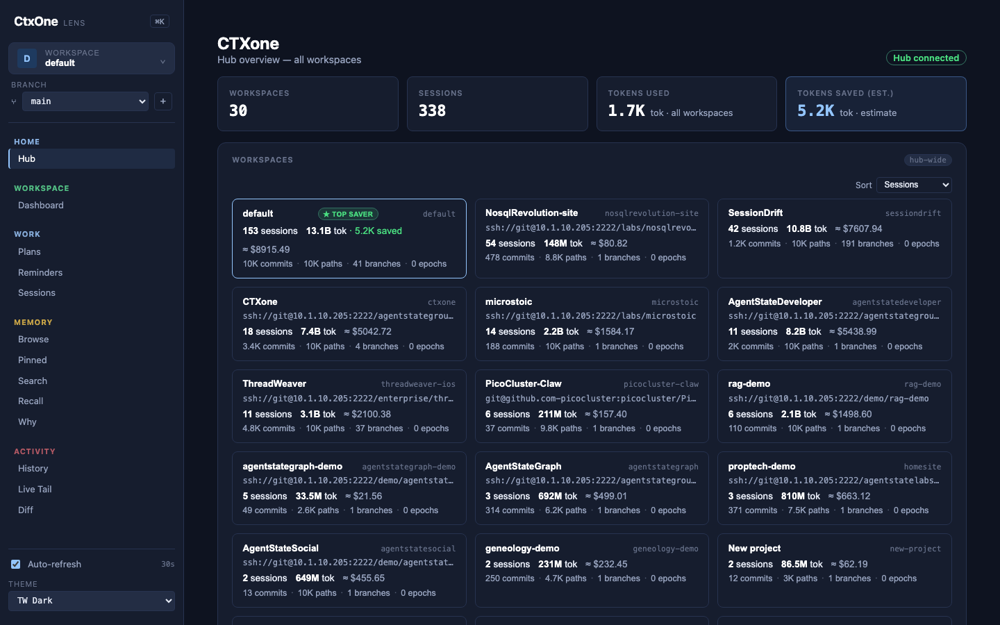
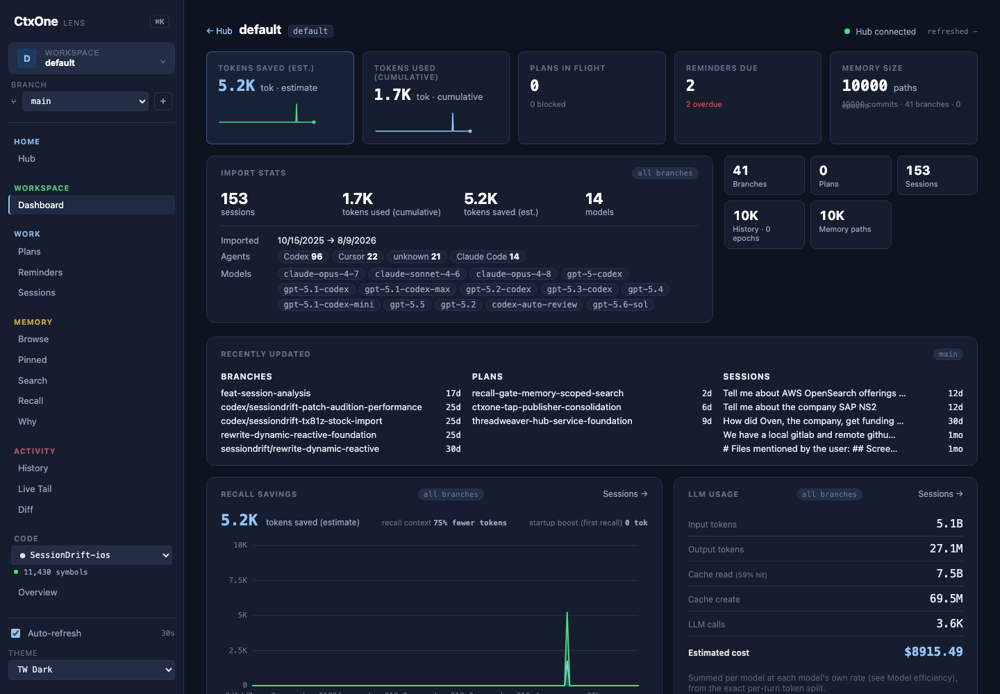
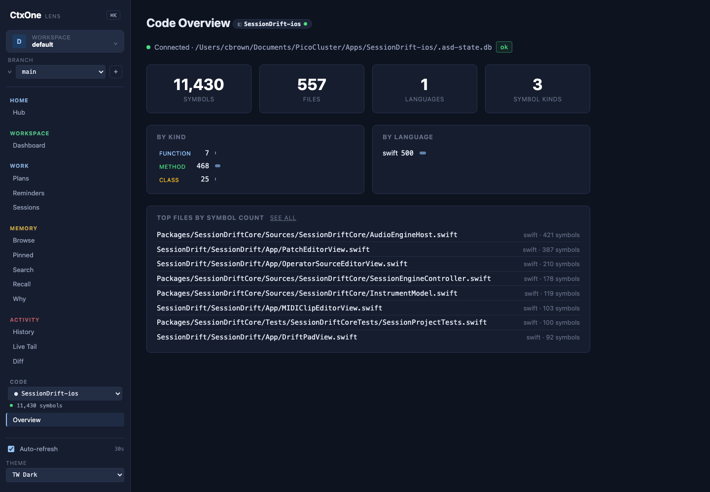
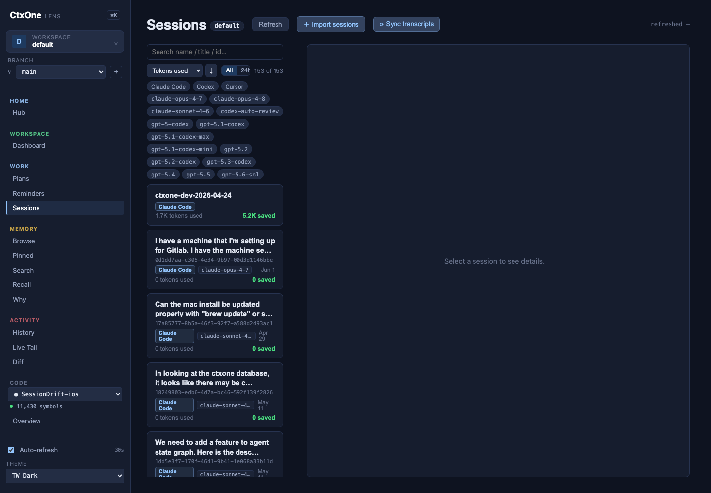

# CTXone

> **The Agent System of Record.**

CTXone records every agent and user interaction — decisions, plans, code changes, and full work sessions — and turns per-agent and per-developer silos into **shared institutional memory** any agent or teammate can recall cold. It's built on [AgentStateGraph](https://github.com/agentstatelabs/agentstategraph), so everything it records is content-addressed, branchable, and blameable: not just *what* was decided, but *who*, *when*, and *why*.

Agents are brilliant and amnesiac. Each session starts from zero, re-derives what was already settled, and evaporates when the window closes — the reasoning, the decisions, and the cost all lost. CTXone is the durable record that fixes that: work happens, CTXone captures it, and the next agent (or the next teammate, or you in three weeks) inherits it instead of rediscovering it.



## What CTXone gives you

- **Durable memory** — `remember` / `recall` decisions, conventions, and gotchas across sessions; token-budgeted recall injects the right prior context instead of re-reading docs (typically thousands-fold cheaper than re-deriving it).
- **Decision provenance** — `why_did_we` and blame trace any decision to who made it, when, and the reasoning — before you reverse a settled call.
- **Plans & tasks that survive sessions** — shared plans with a task state machine, **required proof to close a task and a required summary to close a plan**, agent assignment, and cross-plan links.
- **Full session capture** — a Stop-hook scraper ingests whole transcripts from **Claude Code, Codex, Gemini, and Cursor** into one timeline: every turn, tool call, model, token count, and cost — turning throwaway sessions into a searchable record.
- **Token & cost accounting** — per-session and per-workspace spend, savings, and cache metrics, surfaced live.
- **Sealed checkpoints** — completing a plan automatically seals a per-workspace **epoch**: a point-in-time snapshot of that workspace's memory graph, viewable and downloadable as a JSON audit bundle. Zero extra work — finish a plan, get a checkpoint.
- **CTXone Lens** — a web UI over all of it: dashboard, plans, sessions, memory browse, history, branches, taint, diff, and sealed checkpoints.
- **Team-shared, branchable, multi-repo** — one workspace per repo in a central Hub; isolated agent worktrees, one shared mind. Branches, merges, and taint/quarantine carry through.
- **Connect anything** — a broad MCP tool surface plus an HTTP API, a `ctx` CLI, and a Python client (`pip install ctxone`).

**Part of a suite:** CTXone is the shared **team layer** for
**[AgentStateDeveloper](https://github.com/agentstatelabs/AgentStateDeveloper)**
(per-developer code context). Installing either offers the other — see
[Pairs with AgentStateDeveloper](#pairs-with-agentstatedeveloper).

## Components

| Component | Directory | Description |
|-----------|-----------|-------------|
| **CTXone Hub** | `server/` | MCP server + HTTP API + Lens web UI — one daemon, the memory interface for AI tools |
| **CTXone Engine** | `engine/` | Core memory + graph layer (AgentStateGraph) |
| **CTXone Lens** | `web/` | Web UI: dashboard, plans, sessions, browse, history, branches, taint, diff. ⌘K palette, 15s auto-refresh, multi-theme |
| **ctx** | `cli/` | CLI for memory, plans, branches, taint, and team operations |
| **ctxone (Python)** | `bindings/python/` | Python client library (`pip install ctxone`) |

## CTXone Lens

The web UI over everything CTXone records — dashboards, sessions, code intelligence, and memory, with per-model token and cost accounting throughout.

| | |
|---|---|
| [](docs/img/lens-workspace.png) | [](docs/img/lens-code.png) |
| **Workspace dashboard** — import stats, recall savings, and LLM usage costed per model from the exact per-turn token split. | **Code intelligence** — symbols, files, and call graphs indexed per repo through AgentStateDeveloper. |
| [](docs/img/lens-sessions.png) | |
| **Sessions** — every ingested transcript, filterable by agent and model, each with its token spend and savings. | |

## Pairs with AgentStateDeveloper

CTXone is the **team layer** for
**[AgentStateDeveloper](https://github.com/agentstatelabs/AgentStateDeveloper)** —
they're built as a suite:

- **ASD** — per-developer **code context**: decision ledger, effect
  declarations, call graph, and impact analysis.
- **CTXone** — **shared team memory**: decisions, plans, and context that travel
  across the whole team.

Each works standalone, but together:

- Installing either one **offers to set up the other** — a one-time, dismissable
  nudge (suppress with `--no-nudge` or `CTX_NO_SUGGEST=1`).
- When both are installed, `ctx skill` also installs a **combined suite skill**
  that teaches the agent the joint workflow: use ASD for the code specifics, and
  record what you decide into CTXone so the team inherits it.
- `ctx bootstrap` offers to install **both**.

## Quick Start

**See the [5-minute quickstart](docs/QUICKSTART.md)** — from nothing to live
token savings in 5 minutes.

### Install

**macOS (Homebrew):**

```bash
brew install agentstatelabs/ctxone/ctxone
```

**macOS / Linux** (one-liner):

```bash
curl -sSL https://raw.githubusercontent.com/AgentStateLabs/CTXone/main/install.sh | sh
```

**Uninstall:**

```bash
curl -sSL https://raw.githubusercontent.com/AgentStateLabs/CTXone/main/uninstall.sh | sh
```

**Windows** (PowerShell, one-liner):

```powershell
iwr https://raw.githubusercontent.com/AgentStateLabs/CTXone/main/install.ps1 | iex
```

Full Windows guide with background service setup, AI tool paths,
updates, and troubleshooting: [docs/WINDOWS.md](docs/WINDOWS.md).

**Docker** (any platform — image is multi-arch `linux/amd64` + `linux/arm64`):

```bash
docker run -p 3001:3001 -v ctxone-data:/data ghcr.io/agentstatelabs/ctxone:latest
```

This works identically on macOS (via Docker Desktop), Linux (native),
and Windows (via Docker Desktop's WSL2 backend — the Linux image runs
inside WSL2 and Windows sees port 3001 on localhost). There's no
separate "Windows container" image; Windows users can either run the
Linux image under Docker Desktop or use `install.ps1` for native
`ctx.exe` / `ctxone-hub.exe`.

**Python**:

```bash
pip install ctxone
```

**From source**:

```bash
git clone --recursive https://github.com/AgentStateLabs/CTXone.git
cd ctxone
cargo build --workspace --release
cd web && npm install && npm run build
```

## Setup

Wire CTXone into your coding agent. The fastest path is to let the agent do it.

### Paste-to-your-agent (recommended)

```bash
ctx bootstrap
```

Prints a block you paste into whatever agent you're already in; it installs and
primes CTXone — and offers to set up **AgentStateDeveloper** (code context) too.

### Individual commands

| Command | Sets up |
|---|---|
| `ctx service install` | Run the unified hub (`ctxone-hub --http --lens`) as an always-on login/boot daemon (launchd / systemd / Task Scheduler) — the recommended production path. |
| `ctx init` | Auto-detect and configure your AI tools (MCP). Defaults to `--transport http` (point tools at the running daemon by URL); target one with `ctx init --tool claude` / `--tool cursor`. |
| `ctx agents install` | Write the shared `AGENTS.md` and prime it as pinned memory in the Hub. |
| `ctx skill` | Install CTXone's **Agent Skill** (`SKILL.md`) into each host's skills directory — teaches the agent to record decisions, plans, and memory. Version-stamped. When the `asd` CLI is present, it also installs the combined **CTXone + ASD** suite skill. |

```bash
ctx skill --status    # what's installed, per host
ctx skill --dry-run   # preview without writing
```

## Usage

```bash
# Store a fact
ctx remember "We use BSL-1.1 for all projects" --importance high --context licensing

# Retrieve relevant memories
ctx recall "licensing decisions"

# Load full project context
ctx context myproject

# Track multi-step work across sessions
ctx plan new my-feature
ctx plan add my-feature "Wire up new endpoint"
ctx plan next my-feature        # what should I do next?
ctx plan done my-feature t-001 --proof commit:abc1234

# Link a task to one it satisfies in another plan; find stalled in-progress work
ctx plan link my-feature t-001 other-plan/t-004
ctx plan stale --days 3

# Index canonical docs so agents can discover them by topic
ctx docs add ./docs/ARCHITECTURE.md
ctx docs find "how does recall rank"

# Give each repo its own namespace — branches, plans, and memory isolated per repo
ctx project add myrepo          # commit the .ctxproject marker it writes

# Sandbox speculative work on its own branch (memory follows the branch)
ctx --branch feature/x remember "API renamed from foo to bar"

# Check Hub status and token savings
ctx status
ctx stats
```

## Token Savings

CTXone tracks token usage in real-time. Every response includes how many tokens were
sent vs how many would have been sent with flat memory loading — making the savings
measurable and provable.

## Durability

Your memory db is the only thing in CTXone that can't be regenerated, so
the hub treats it as the crown jewel. All defenses are on by default:

- **Automatic snapshots** via SQLite `VACUUM INTO` — one on startup and
  one every 30min (configurable: `CTXONE_BACKUP_INTERVAL_SECS`,
  `CTXONE_BACKUP_KEEP`). Stored next to the db as `<db>.bak.<utc>`.
- **PID lockfile** — a second hub against the same db refuses to start
  with a clear error instead of silently corrupting writes.
- **Inode-drift watchdog** — if the db file is `rm`'d or replaced under
  a running hub, you get a WARN within 30s instead of silent loss at
  next restart.
- **Strict argv** — `ctxone-hub --version` and `--help` short-circuit
  before any storage code runs, and a missing db file is only created
  when you pass `--init`. Stray invocations no longer leave debris.
- **Recovery** — `ctx db backup` triggers a snapshot on demand;
  `ctx db restore <snapshot>` swaps one back in (current db is
  preserved at `<db>.pre-restore-<ts>` first).
- **Portable snapshots** — `ctx db export` writes the branch graph to a
  portable JSON file; `ctx db import` merges one back — for migration,
  review, or seeding another db.
- **`ctx doctor`** flags inode drift, stray db files, and missing
  recent backups, with one-line fixes.

Full details: [Data Safety](docs/DATA_SAFETY.md).

## Architecture

```
ctxone/
├── cli/           # ctx CLI (Rust)
├── server/        # CTXone Hub — MCP server (Rust)
├── engine/        # AgentStateGraph core (git submodule)
├── web/           # CTXone Lens — web UI (SvelteKit)
├── docs/          # Product strategy and design docs
├── install.sh
├── Dockerfile
└── docker-compose.yml
```

## Documentation

**Get started:**
- [Quickstart](docs/QUICKSTART.md) — from nothing to live token savings in 5 minutes
- [Walkthrough](docs/WALKTHROUGH.md) — install → daily loop → what happens under the covers → using CTXone + ASD together
- [Windows guide](docs/WINDOWS.md) — full install, background service, and troubleshooting for Windows
- [Architecture](docs/ARCHITECTURE.md) — the mental model (pinned vs primed, how recall ranks, why O(log n))
- [Token Savings](docs/TOKEN_SAVINGS.md) — how the ratio is computed, how to read it, how to maximize it
- [Cookbook](docs/COOKBOOK.md) — git hooks, cron jobs, shell prompts, team setups
- [Data Safety](docs/DATA_SAFETY.md) — snapshots, lockfile, watchdog, and `ctx db backup`/`restore`

**Reference:**
- [Features & Command Reference](docs/FEATURES.md) — what CTXone does, grouped by capability
- [CLI Reference](docs/CLI_REFERENCE.md) — every `ctx` command, flag, and exit code
- [HTTP API](docs/HTTP_API.md) — REST endpoints exposed by the Hub
- [MCP Tools](docs/MCP_TOOLS.md) — MCP tools exposed to agents
- [Integrations](docs/INTEGRATIONS.md) — wiring into Claude Code, Cursor, VS Code, Codex
- [Open WebUI](docs/OPENWEBUI.md) — native Tool + Filter plugins for Open WebUI
- [Troubleshooting](docs/TROUBLESHOOTING.md) — top 10 errors and fixes

**Runnable examples:** see [examples/](examples/)

**Strategy and background:**
- [Product Vision](docs/VISION.md)
- [Context Anxiety](docs/CONTEXT_ANXIETY.md) — the problem we solve
- [Token Economics](docs/TOKEN_ECONOMICS.md) — the math behind the savings ratio
- [Use Cases](docs/USE_CASES.md)
- [Memory MCP Design](docs/MEMORY_MCP_DESIGN.md) — technical design

## License & editions

CTXone is open source: the full self-hosted Hub — memory, plans, recall,
branches, token-savings accounting, and Lens UI. No account required. It pairs
with **[AgentStateDeveloper](https://github.com/agentstatelabs/AgentStateDeveloper)**
as the suite's code-context half.

The code is licensed under the **Business Source License 1.1 (BSL 1.1)**.
**You can** use CTXone in production, self-host it, modify it, and build on top
of it — all without a commercial license. **You cannot** offer CTXone itself as
a competing managed service or redistribute it inside a product you sell. Each
version converts to **Apache License 2.0** four years after release.

Full plain-English summary: [LICENSING.md](LICENSING.md) ([LICENSE](LICENSE)
is the legal text).

## Contributing

See [CONTRIBUTING.md](CONTRIBUTING.md) for development setup, project structure,
and how to get involved. All contributors are expected to follow the
[Code of Conduct](CODE_OF_CONDUCT.md).
